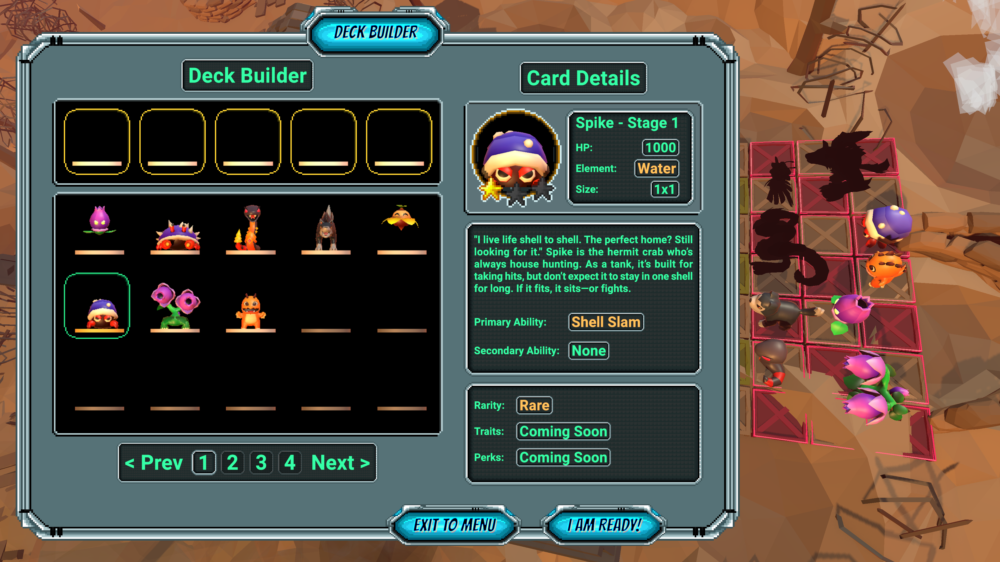

# G.R.I.D. – Strategy/Tactics Game in Unity

This project was developed at FH Wedel as part of the **Game Design Project** module.

A 3D single-player strategy/tactics game prototype built in Unity, focusing on game balance, visual clarity, and technical extensibility.
The concept and gameplay were inspired by games like **Plants vs. Zombies** and **Pokémon**.

> **Note:** This repository only contains the Unity build, not the source code.

## Gallery

## Download

A release package is available [here](https://github.com/lufa3014/Grid-Prototyp/releases/latest) containing:

- Unity build (Windows)